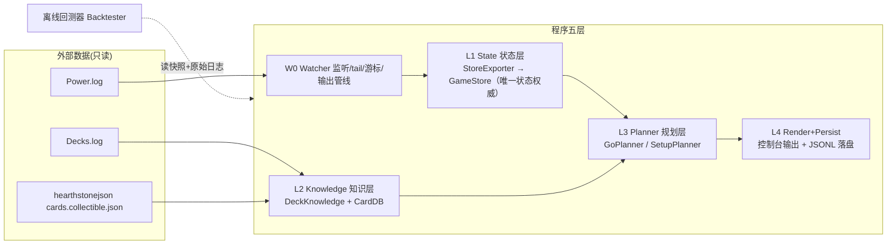
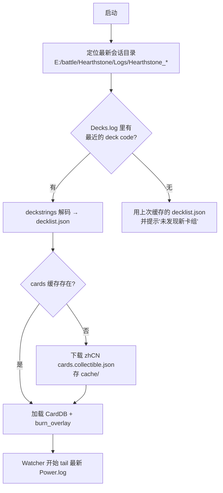
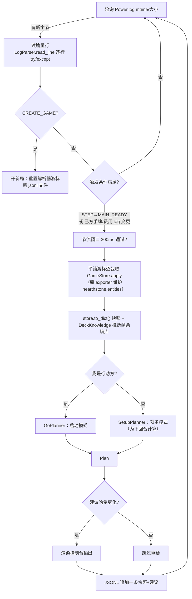
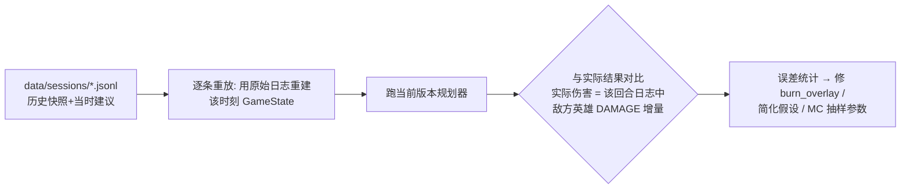

# hs_game_bot 设计文档 —— 奇迹德实时军师

> 状态：设计稿 v1（2026-09-06）。真人操控，程序只读日志、输出建议，不注入任何操作。
> **M1 监控层已实现并通过回放验收（`hsbot/` 包，用法见 M1_MONITOR.md §1）。**
> 卡组：狂野奇迹德（光子炮台 OTK）。日志源：`E:\battle\Hearthstone\Logs\`。
> 已验证的可行性证据与卡组解码结论见仓库对话记录 / 项目记忆，本文只讲"怎么造"。

---

## 1. 目标与非目标

**目标**

- G1 实时跟踪最新一局，在每个需要决策的时刻给出：本回合怎么打（顺序）、伤害期望与分布、斩杀概率。
- G2 回答"预备回合"问题：本回合垫什么，下回合斩杀概率多少。
- G3 每次出牌/抽牌后动态刷新建议；给出法强堆叠曲线、单张牌的"可卖性"（机会成本）。
- G4 每回合落盘快照 + 当时建议，形成可回测的决策日志。

**非目标（明确不做）**

- N1 不自动出牌，不注入鼠标键盘事件。
- N2 不做米斯塔（VAC_519）跨回合重放计划——概率只算"本回合"与"下回合"两个尺度。
- N3 不对对手建模（不猜对面手牌/奥秘；对面信息只用可见部分）。
- N4 不做多卡组泛化框架——组件表是数据文件，换卡组 = 换数据，不写第二套代码。

---

## 2. 系统架构



| 模块 | 职责 | 依赖的既有轮子 |
|---|---|---|
| W0 Watcher | 轮询日志增量、切局、发事件（回合开始/手牌变更/局终） | `hslog.LogParser`（可增量喂行） |
| L1 State | packet 直投 GameStore（每局一个，库驱动唯一权威）；GameState 协议层退役，导出为 `store.to_dict()`（JSONL 字段级兼容） | `hslog.export.EntityTreeExporter / FriendlyPlayerExporter` |
| L2 Knowledge | 卡组 30 张多重集、卡牌属性字典、直伤/效果覆盖表、剩余牌库推断 | `hearthstone.deckstrings`、hearthstonejson JSON |
| L3 Planner | 启动/预备两种模式的无状态规划：DFS+蒙特卡洛 | 无（自写，~200 行级） |
| L4 Render+Persist | 控制台建议输出、JSONL 快照追加、节流去重 | 无 |

---

## 3. 数据结构

- **adapter 是全项目唯一允许 import hslog 解析/导出类的模块**(LogParser、packets、
  exporter 及其子类)。`hearthstone.enums` 与 `hearthstone.entities` 是全项目共享的
  状态模型与枚举;hsbot 的实体状态就维护在 hearthstone.entities 上(库驱动,不造轮子)。

### 3.1 状态层（L1）

> 2026-09-08 GameStore 重构修订:本节的 `Entity`/`GameState` 协议层已退役——实体状态由库
> `hearthstone.entities` 承载(adapter.StoreExporter 维护),查询 API 上移至 `GameStore`
> (签名不变,spec §3.3),导出为 `store.to_dict()`(JSONL 字段级兼容)。下方代码块为重构前存档,保留备查。

```python
PlayerKey = int  # 约定：统一使用 PLAYER_ID 命名空间(1=先手, 2=后手/硬币)
                 # 适配器负责把实体 controller(实体id) 翻译成 PLAYER_KEY，彻底消灭两个命名空间混用的坑

@dataclass
class Entity:
    """协议忠实：实体 = id + card_id + 标签桶。区域/费用/攻血都是普通标签。"""
    id: int
    card_id: str | None          # 己方手牌必有；对方手牌/己方牌库实体为 None
    controller_key: PlayerKey | None
    tags: dict[GameTag, int]     # 全量拷贝，不做解释性投影

@dataclass
class GameState:
    """一局某一时刻的完整快照（可 deepcopy、可导出 JSON）。"""
    entities: dict[int, Entity]
    game_tags: dict[GameTag, int]      # TURN / STEP / STATE ...
    player_names: dict[PlayerKey, str]
    friendly_key: PlayerKey
    meta: dict[str, str]               # GameType/FormatType/BuildNumber/ScenarioID
    lines_consumed: int                # 已消费日志行数（增量游标、事件去重）

    # 派生查询（方法，不另存状态）
    # hand(key) / board(key) / deck_count(key) / hero_total_hp(key)
    # mana_now(key)      = RESOURCES + TEMP_RESOURCES − RESOURCES_USED
    # mana_next_turn(key)= min(10, RESOURCES + 1 − OVERLOAD_OWED − OVERLOAD_LOCKED)
    # friendly_turn      = TURN 换算成"我的第 N 回合"（看 FIRST_PLAYER，TURN 是半回合制）
    # is_my_turn()       = CURRENT_PLAYER 标签在玩家实体上，不在 Game 实体上
```

### 3.2 知识层（L2）

```python
@dataclass(frozen=True)
class CardInfo:                       # 卡牌属性（只缓存组合件关心的字段）
    id: str
    name: str
    cost: int
    cardtype: str                     # SPELL / MINION / ...
    race_tag: str | None              # NATURE(自然) / PROTOS(星灵) —— 影响衍生/减费联动

# 直伤与特殊效果不在官方 JSON 里，用人工覆盖表维护（全卡组仅 ~15 张，数据文件而非代码）：
# burn_overlay.json: { "SC_753": {"cost":2,"face":3,"protoss_discount_kill":1},
#                      "CS2_008": {"cost":0,"face":1},
#                      "TID_001": {"cost":1,"face":2,"hits":2},
#                      "CORE_AT_037": {"cost":1,"face":2,"mode":"damage|saplings"},
#                      "BT_724": {"cost":1,"needs_target":"minion","spell_damage":1},
#                      "VAC_428": {"cost":1,"needs_target":"friendly_minion","spell_damage":1,"or":"freeze"},
#                      "SCH_427": {"cost":0,"refresh":2,"overload":2},
#                      "EX1_169": {"cost":0,"temp_mana":1},
#                      "BOT_054": {"cost":1,"both_mana":2},
#                      "AV_295": {"cost":2,"draw":"lowest|highest"},
#                      "TSC_654": {"cost":0,"dredge_if_affordable":true},
#                      "TIME_701": {"cost":1,"discover_to_bottom":true},
#                      "JAIL_718": {"cost":9,"engine":true},
#                      "SC_755": {"cost":0,"generated":true,"protoss_discount_next":2} }

@dataclass
class DeckKnowledge:
    decklist: dict[str, int]          # 30 张多重集 card_id -> 张数（来自 Decks.log 解码）
    seen_from_deck: dict[str, int]    # 本局已见且"来自牌库"的张数（手牌/场面/墓地）

    def remaining(self) -> dict[str, int]:
        """牌库剩余期望组成 = decklist − seen_from_deck。
        注意：衍生牌(CREATOR 标签非空，如 SC_755 建造水晶塔)不计入 seen——它本来就不在牌库里。"""

    # 牌库序视图（从快照重建，不维护历史，见 M1_MONITOR.md §3.1）：
    #   已知顶牌（探底置顶未抽 → 下一抽确定）、已知底部 k 张（置底/探底揭示）、未知中段多重集
    def known_top(self) -> str | None: ...
    def known_bottom(self) -> list[str]: ...
```

### 3.3 规划层（L3）

```python
@dataclass(frozen=True)
class SimState:
    """规划器内部的轻量可哈希状态——与 GameState 完全解耦，DFS/记忆化都用它。"""
    mana: int
    hand: tuple[tuple[str, int], ...] # 排序后的手牌多重集（可哈希）
    spell_damage: int
    sd_carriers: int                  # 可挂法强的己方随从数（树苗/拍卖师）。
                                      # 关键机制：改装师/漂流必须以己方随从为目标，
                                      # 活体根须选"树苗"分支就是法强载体的生产来源
    engine_on: bool                   # 拍卖师已下场 → 之后每施放一个法术抽 1
    protoss_discount: int             # 已生效的星灵减费（水晶塔/炮台击杀累计）
    face_damage: int                  # 已累计对脸伤害
    drawn: tuple[str, ...]            # 本线内已"中途抽到"的牌（MC 预先抽样好的序列）
    drawn_pos: int

@dataclass
class DamageDistribution:             # MC 聚合结果
    samples: list[int]
    # p_lethal(hp) / expected() / percentile(p)

@dataclass
class Action:                         # 给人的单步建议
    text: str                         # "打 光子炮台(0费) → 脸"
    card_id: str

@dataclass
class Plan:                           # 一次规划的完整输出
    mode: str                         # "go" | "setup"
    actions: list[Action]             # actions[0] = 下一步最优（动态调整即由此刷新）
    dist: DamageDistribution          # 本回合伤害分布
    p_lethal_now: float
    next_turn_options: list["SetupOption"] | None   # 仅 setup 模式
    sd_curve: list[tuple[int, float]]               # 法强 k -> 期望伤害
    sell_notes: list["SellNote"]

@dataclass
class SetupOption:                    # 预备候选（枚举产生，一般 2~4 个）
    label: str                        # "下拍卖师+挂1法强" / "不动"
    pre_actions: list[Action]
    p_lethal_next: float
    missing: list[str]                # 还缺哪些组件
    p_missing_within_draws: float     # 缺件在 N 抽内到手的概率

@dataclass
class SellNote:                       # 单张牌的机会成本
    card_id: str
    p_delta: float                    # 卖掉它，下回合 P(斩杀) 变化
    verdict: str                      # "可卖" / "别卖"（阈值可配置）
```

### 3.4 持久化（L4）——见第 7 节文件格式

---

## 4. 关键流程

### 4.1 启动引导流程



### 4.2 实时主循环（核心流程）



触发条件明细（T4）：

| 事件 | 日志特征 | 作用 |
|---|---|---|
| 我的回合开始 | `STEP` 变为 `MAIN_READY` 且行动方=己方 | 全量重算（启动模式） |
| 己方抽/出牌 | `ZONE` 变更涉及己方 HAND、`FULL_ENTITY` 创建于己方 HAND | 手牌变了，重算 |
| 费用变化 | 己方 `RESOURCES_USED / TEMP_RESOURCES / OVERLOAD_*` 变更 | 可打序列变了，重算 |
| 局终 | 玩家 `PLAYSTATE` → WON/LOST | 落盘收尾，回到等待 |

### 4.3 出牌后动态调整（复用 4.2，无独立状态机）

规划器是**纯函数** `plan(snapshot, knowledge) -> Plan`，不维护长期计划。人每出一张牌 → 日志新增 tag 行 → 重跑一遍 → 新 `Plan.actions[0]` 就是"现在最优的那张牌"。没有"计划失效"的边界情况需要处理。

### 4.4 离线回测校准流程



价值：简化模型（尤其"中途抽牌"和"水栖形态条件抽"）不可能一次写对，但每一条假设都有几十局真数据可对账。

---

## 5. 设计模式应用（按模块，只列真实起作用的）

| 模式 | 用在哪 | 解决什么 |
|---|---|---|
| **适配器** | `StoreExporter`（容错子类+挂钩）逐包应用；`FriendlyPlayerExporter` 友方探测 | 隔离 hslog 版本升级；统一 PLAYER_KEY 命名空间（实体 id vs PLAYER_ID 的坑在适配器里一次性消灭） |
| **备忘录** | `store.to_dict()` JSONL + packet 前缀重放（任意历史状态可重建） | 任意时刻状态可存可回放；回测器直接消费 |
| **观察者** | `store.subscribe(回调)` | 链路事件由状态迁移衍生（渲染/M2 同轨） |
| **策略** | `GoPlanner` / `SetupPlanner` 实现同一接口 `plan(gs, knowledge) -> Plan` | 两种模式共享同一套 DFS+MC 引擎，只是"输入状态的构造方式"不同 |
| **纯函数核心 + 命令式外壳**（functional core, imperative shell） | L3 无状态；W0/L4 有状态 | 规划器可缓存、可并发跑 MC、可测试、可回放——这是全文档最重要的一条 |
| **状态机** | Watcher：`IDLE → IN_GAME ⇄ PLANNING → GAME_END` | 切局/重连/脏行的生命周期管理，防止上一局状态泄漏 |
| **享元 + 缓存** | `CardDB` 只读字典，进程内单份 | 8154 张卡不重复构建；离线可跑 |
| **管道（模板方法思想）** | `源 → 快照 → 知识 → 规划 → 渲染` 各环用 dataclass 传参 | 回测器只替换第一环（快照来源从"实时"换成"重放"），其余复用 |
| **数据驱动配置** | 组件效果 = `burn_overlay.json`，非代码 | 换卡组/调数值不改代码；N4 非目标的落地方式 |

刻意不用的：重量级事件总线、依赖注入框架、ORM——规模不需要。

---

## 6. 算法设计

### 6.1 启动模式 DFS（确定性部分）

```text
move 集合 = { 打出每张可支付的手牌（含衍生牌） }   # 场面攻击 v1 忽略（奇迹德通常无场面，字段预留）
可支付     = cost(piece, state) ≤ mana
cost      = max(0, base_cost − protoss_discount(若是星灵牌))   # 水晶塔/炮台击杀减费
打出效果   = face += (面板直伤 + spell_damage)      # 逐段：月光射线 hits=2 逐段加
            spell_damage += piece.spell_damage      # 需 sd_carriers ≥ 1，消耗一个载体
            mana += temp/refresh；overload 挂账（只影响下回合，不影响本线）
            engine_on：之后每打一张法术 → drawn_pos += 1，抽牌来自 MC 预抽样
            protoss_discount 累加（水晶塔立即，炮台击杀条件简化为立即，回测校准）

记忆化 key = (mana, hand多重集, spell_damage, sd_carriers, engine_on, protoss_discount, drawn_pos)
上界剪枝   = 当前伤害 + Σ剩余手牌最大伤 + 剩余抽牌最大伤 ≤ 已记录最优 → 砍
输出       = 最优线（actions 顺序即建议）+ 该线的确定性伤害
```

空间可行性：手牌 ≤10、费 ≤10、`drawn` 由 MC 预先固定 → 每条 MC 线内是纯确定性 DFS。

### 6.2 蒙特卡洛外壳（中途抽牌未知）

```text
重复 N 次（N≈2000，可配）:
    剩余牌库多重集 ← DeckKnowledge.remaining()     # 30 张全知 − 已见
    k              ← 本线预计消耗的抽牌数（拍卖师线按法术数估，保守给上限）
    sample         ← 从牌库多重集不放回抽 k 张      # 一次抽样代表"这一线的手气"
    跑 6.1 DFS(drawn=sample) → 记录最终伤害
汇总 → DamageDistribution
P(斩杀) = P(分布 ≥ 对面血+甲)      # 输出分布而非单点，是"概率"二字的来源
```

降方差要点：牌库序视图（M1_MONITOR.md §3.1）提供**已知顶牌**（水栖形态探底置顶未抽）与已知底部段——抽样时顶牌是确定值、不进随机抽样；已知牌从抽样池剔除。探底用得越多，"下回合斩杀概率"的方差越小，这正是记录牌库序的算法层回报。

### 6.3 预备模式（下回合斩杀概率）

```text
预备候选 = enumerate_setup_options():
    "不动" / "只下拍卖师" / "下拍卖师+挂1法强" / (牌很差时"全卖小伤害")
对每个候选:
    下回合状态 ← mana = min(10, RESOURCES + 1 − 过载)；固定抽 1 张（未知 → 并入 MC 抽样）
    对"抽到的牌 × 中途抽牌"联合抽样，跑 6.1 → P(下回合斩杀)
输出对比: 现在启动 P  vs  各候选下回合 P
```

### 6.4 缺件概率（超几何，精确）

```text
P(接下来 d 抽内见到某缺件) = 1 − C(n−k, d) / C(n, d)
    n = 当前牌库张数（真实实体计数），k = 该缺件剩余张数，d = 到某回合前的抽牌数
多件联合、以及"费用也够"的联合概率 → 不用公式，直接由 6.3 的 MC 顺带给出
```

### 6.5 法强曲线与可卖性

- 法强曲线：对 k = 0..4 分别把 `spell_damage` 固定为 k 跑 6.2，输出 `期望伤害(k)`。边际收益 ≈ 手牌直伤张数，曲线自然出现拐点（预期在 2~3）。
- 可卖性：对手牌中每张直伤/法强牌 x：`p_卖掉 = 对 6.3 移除 x 后重跑`，`p_delta = P_基准 − p_卖掉`。输出排序后的 `SellNote`；判定阈值默认 `delta < 2%` 提示"可卖"，做成配置项（激进程度由人调）。

---

## 7. 持久化与文件布局

```text
hs_game_bot/
├─ data/
│  ├─ decks/decklist.json            # {"code":"AAEB...","cards":{"SC_753":2,...}}
│  ├─ cache/cards.zh.json            # hearthstonejson 缓存（下载一次）
│  ├─ burn_overlay.json              # 3.2 节人工效果表
│  └─ sessions/20260906_0015/
│     └─ game_002.jsonl              # 一局一文件，每回合一行，append-only
```

JSONL 单行 schema：

```json
{
  "ts": "2026-09-06T00:20:11",
  "lines_consumed": 18233,
  "turn": 8, "friendly_turn": 4, "my_turn": true,
  "me":   {"hp": 30, "mana": 7, "mana_next": 8, "overload": 0,
           "deck": 18, "hand": ["SC_753", "CS2_008", "..."], "board": []},
  "opp":  {"hp": 24, "armor": 0, "hand_n": 4, "deck": 12,
           "board": [{"card_id": "...", "atk": 3, "hp": 2, "taunt": false}]},
  "advice": {
    "mode": "setup",
    "p_lethal_now": 0.09,
    "actions": ["打 黑市拍卖师(9-0费)", "..."],
    "next_options": [{"label": "下拍卖师+挂1法强", "p_lethal_next": 0.81,
                      "missing": ["SC_753"], "p_missing_2draws": 0.37}],
    "sd_curve":  [[0, 54], [1, 61], [2, 65]],
    "sell_notes": [{"card_id": "CS2_008", "p_delta": 0.02, "verdict": "可卖"}]
  }
}
```

原则：**Power.log 本身就是最高保真存档**（客户端已按会话归档），程序只存"日志推导不出来的东西"——即当时的建议与概率，供回测和复盘。不建数据库，JSONL 足够。

---

## 8. 简化假设清单（每条都可被 4.4 回测推翻/校准）

| # | 假设 | 理由 / 回退方案 |
|---|---|---|
| A1 | 不解场、不互动，全部伤害打脸 | 自闭策略定义；嘲讽随从只打印警告 |
| A2 | 对手无干扰（奥秘/扰咒不建模） | N3；P 值含义 = "无干扰下" |
| A3 | 炮台击杀减费视为立即生效 | 实际需"消灭随从"才触发；回测偏差大再改成条件生效 |
| A4 | 水栖形态：探底=顶抽 1 张 | 真实是"费用够才抽"；保守版本=不计入抽牌，回测定 |
| A5 | 波涛形塑发现=等概率三选一，置底=过滤牌库 | 对剩余牌库组成有微小影响，v1 忽略置底修正 |
| A6 | MC 每线抽牌数 k 用上界估计 | 高估抽牌=略乐观；偏差由回测报告 |
| A7 | 场面攻击不计入伤害（字段预留） | 奇迹德场面通常为 0；树苗 1 攻忽略 |

---

## 9. 坑与注意事项（全部实测踩过）

1. **两个命名空间**：玩家实体 id（2/3）≠ `PLAYER_ID`（1/2）。比较"是不是我"必须用 `tags[PLAYER_ID]`。适配器统一翻译（见 3.1）。
   **实测补充**：`FriendlyPlayerExporter` 的"第一条 SHOW_ENTITY 属于友方"启发式在同一会话的不同局可能翻转（镜像对局/对手手牌被提前揭示时）。友方判定以 `--battletag` 战网名匹配为首选，exporter 仅兜底（已实现）。
2. **费用四件套**：`RESOURCES / RESOURCES_USED / TEMP_RESOURCES / OVERLOAD_OWED+LOCKED`，缺一不可；雷霆绽放的过载只在"下回合"公式里扣。
3. **CURRENT_PLAYER 在玩家实体上**，不在 Game 实体上；`TURN` 是半回合制，"我的第 N 回合"要按 `FIRST_PLAYER` 换算。
4. **脏行**：hslog 对个别行会抛异常（如 `PlayerReference` 传入导出器），逐行 try/except 跳过；导出实体树用 `tolerate_missing_entities=True`。切局时如果上一局解析不完整，直接放弃该局。
5. **衍生牌**：有 `CREATOR` 标签的实体（SC_755 等）不占用牌库张数，但必须进手牌知识与 overlay 表。
6. **触发去重**：建议哈希（actions+概率四舍五入）不变就不重绘，防刷屏；节流 300ms。
7. **日志文件**：UTF-8；单局可达 MB 级，切局后只增量解析；一局日志里 `CREATE_GAME` 会出现两次（GameState 与 PowerTaskList 两个打印机），按 `GameState.DebugPrintPower()` 的行切局。
8. **生物计划打哪个标签**（RESOURCES 还是 TEMP_RESOURCES）需实测一次确认，影响 6.3 下回合费用公式——列入 M1 验证项。

---

## 10. 里程碑

> 目录结构、模块依赖图、排期总览见 [PROJECT.md](PROJECT.md)；M1 施工图见 [M1_MONITOR.md](M1_MONITOR.md)。

| 阶段 | 内容 | 验收标准 |
|---|---|---|
| M1 | Watcher + 适配器 + JSONL 落盘 + 局面概览打印（**施工图：[M1_MONITOR.md](M1_MONITOR.md)**） | 打一局，控制台每回合正确显示双方血/费/手牌/牌库；坑 8 顺手验证 |
| M2 | CardDB + decklist + 缺件超几何曲线 | "还差 1 张光子，2 抽内到手 37%" 这类输出 |
| M3 | 启动模式 DFS（先做无 MC 的确定性版） | 手牌全知的局面给出最优线与总伤 |
| M4 | MC 外壳 + 预备模式 + 可卖性/法强曲线 | 4.2 全流程闭环，建议动态刷新 |
| M5 | 回测器 + 校准（假设表逐条对账） | 历史局上误差报告：期望伤害 vs 实际伤害 |
