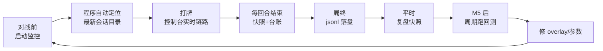
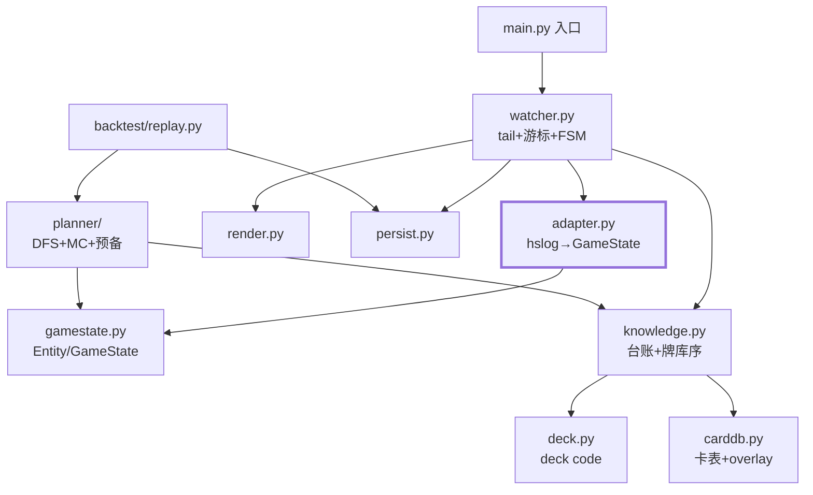

# hs_game_bot 项目蓝图 —— 结构 · 流程 · 规划

> 本文是全局视图：最终目录结构、运行入口、模块依赖、使用流程、里程碑排期。
> 细节文档：[DESIGN.md](DESIGN.md)（总设计）· [M1_MONITOR.md](M1_MONITOR.md)（M1 施工图）。

---

## 1. 目录结构（最终形态，标注引入里程碑）

```text
hs_game_bot/
├─ README.md                        # 已有
├─ requirements.txt                 # 已有（hslog, hearthstone）
├─ .gitignore                       # 已有，需补 data/ 生成物规则（见 §6）
├─ docs/
│  ├─ DESIGN.md                     # 总设计（已有）
│  ├─ M1_MONITOR.md                 # M1 施工图（已有）
│  └─ PROJECT.md                    # 本文档
├─ examples/                        # 已有：解析教学样本；Power.log 留作回归素材
├─ data/                            # 运行时数据（git 策略见 §6）
│  ├─ burn_overlay.json             # [M2] 组件效果表——人工维护，入库
│  ├─ decks/decklist.json           # [M2] 由 deck code 生成，忽略
│  ├─ cache/cards.zh.json           # [M2] hearthstonejson 缓存，忽略
│  └─ sessions/<时间戳>/game_NNN.jsonl  # [M1] 每局快照，忽略
└─ hsbot/
   ├─ __init__.py
   ├─ config.py                     # [M1] 路径/卡组名/节流，纯数据
   ├─ gamestate.py                  # [M1] Entity / GameState（协议忠实，DESIGN §3.1）
   ├─ adapter.py                    # [M1] packet树→GameState；全项目唯一 import hslog 的模块
   ├─ watcher.py                    # [M1] tail + packet游标 + FSM(IDLE/IN_GAME/GAME_END) + 事件
   ├─ knowledge.py                  # [M1] 组件台账 + 牌库序（known_top/known_bottom/中段）
   ├─ overlay.py                    # [M1] 半透明置顶日志窗(tkinter) + OutputHub 三路输出
   ├─ corpus.py                     # [M1] 训练语料: packet→JSONL 归一化, 按卡组分目录, import-all 子命令
   ├─ render.py                     # [M1] 链路行 + 快照块；[M2]台账渲染；[M4]建议渲染
   ├─ persist.py                    # [M1] sessions jsonl 追加
   ├─ main.py                       # [M1] 入口：python -m hsbot
   ├─ deck.py                       # [M2] Decks.log 监听 + deckstrings 解码 → decklist.json
   ├─ carddb.py                     # [M2] cards.zh.json 加载 + burn_overlay 效果表
   ├─ planner/
   │  ├─ probability.py             # [M2] 超几何缺件概率
   │  ├─ simstate.py                # [M3] 轻量可哈希状态（mana/手牌多重集/法强/载体/引擎）
   │  ├─ dfs.py                     # [M3] 启动模式确定性 DFS（记忆化+上界剪枝）
   │  ├─ montecarlo.py              # [M4] MC 外壳（中途抽牌抽样、已知顶牌确定化）
   │  ├─ setup.py                   # [M4] 预备模式（候选枚举 × 下回合 P）
   │  └─ plan.py                    # [M4] Plan / Action / SetupOption / SellNote
   └─ backtest/
      └─ replay.py                  # [M5] 快照重放 + 与实际结果对账
```

演进原则：**每个里程碑只新增文件、不改既有文件的骨架**；`render.py` 是唯一允许跨里程碑持续扩展的模块（输出形态会一直加），`knowledge.py` 在 M2 拆出 `deck.py/carddb.py` 后退化为纯台账+牌库序。

---

## 2. 运行入口与使用流程

两个入口，共用同一套管线（回测只是换了数据源）：

```text
python -m hsbot                                          # 实时监控（M1 起, 配置见 config.yaml）
python -m hsbot replay examples/Power.log                           # 重放静态日志（M1 验收/开发用）
python -m hsbot.backtest --sessions data/sessions/...                 # 离线回测（M5）
```

`replay` 子命令的意义：不开游戏就能跑完整验收（M1_MONITOR §6 的六条全部可在样本日志上核对），也方便下断点调试。

日常使用流程：



---

## 3. 模块依赖图



两条铁律（违反即架构腐化）：

1. **`adapter.py` 是唯一 import hslog/hearthstone 实体类的模块**（图中加粗边）。第三方升级时只动它一个文件。
2. 依赖方向永远 `watcher → knowledge/planner`，规划器绝不反向调用渲染/持久化——它是纯函数（DESIGN §5"纯函数核心"）。

实时主循环细节见 [M1_MONITOR.md §4.2](M1_MONITOR.md)，此处不重复。

---

## 4. 里程碑规划

| 里程碑 | 目标 | 新增文件 | 验收 | 预估 |
|---|---|---|---|---|
| **M1 监控层** | 日志监控 + 状态维护 + 链路/快照输出 + jsonl | config / gamestate / adapter / watcher / knowledge / render / persist / main | M1_MONITOR §6 六条（可用 `replay` 子命令先过一遍，再上真实对局） | 1~2 人日 |
| **M2 知识层** | deck code→卡组、卡表+overlay、缺件概率曲线 | deck / carddb / planner/probability | "还差1张光子，2抽内到手37%" 这类输出；台账与牌局一致 | 1 人日 |
| **M3 启动 DFS** | 手牌全知的确定性最优线与总伤 | planner/simstate / dfs | 构造局面：给出的打牌顺序经人工验证为最优 | 1~2 人日 |
| **M4 MC+预备** | 中途抽牌 MC、下回合 P、法强曲线、可卖性 | planner/montecarlo / setup / plan | 全闭环：建议动态刷新，P 值随抽牌实时更新 | 2~3 人日 |
| **M5 回测** | 快照重放对账，校准假设表 | backtest/replay + 报告输出 | 期望伤害 vs 实际伤害误差报告；A1~A7 假设逐条有结论 | 1~2 人日 |

依赖关系严格线性：M1 → M2 → M3 → M4 → M5（M3 的 DFS 需要 M2 的卡表费用/伤害数据）。
每阶段交付即可运行、可验收的程序，不存在"全部做完才能跑"的集成风险。

---

## 5. 与现有 examples/ 的关系

- `examples/hslog_utils.py` 的 `iter_game_chunks / parse_lines / build_game` 三个函数是 `adapter.py / watcher.py` 的直接起点（M1 搬进包内，带 `tolerate_missing_entities=True`）。
- `examples/full_game_info.py / realtime_demo.py` 保留作教学参考，不再演进。
- `examples/Power.log` 定位转为**回归测试素材**：M1 的 `replay` 子命令验收、M5 的算法回归都用它，升级 hslog 版本后重跑一遍即可发现解析兼容性问题。

## 6. Git 与数据文件策略

| 类别 | 处理 |
|---|---|
| 入库 | `docs/`、`hsbot/`、`examples/`、`data/burn_overlay.json`（人工维护的组件效果表，是"代码"不是数据） |
| 忽略 | `data/sessions/`、`data/cache/`、`data/decks/`（全部为生成物）；`.gitignore` 补三条规则 |
| 提交节奏 | 每个里程碑一个分支，验收标准全过才合入 main；提交信息建议 `M1: 监控层——链路输出+回合快照` 样式 |
