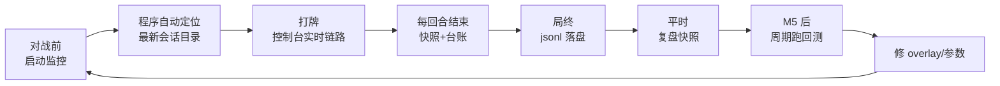
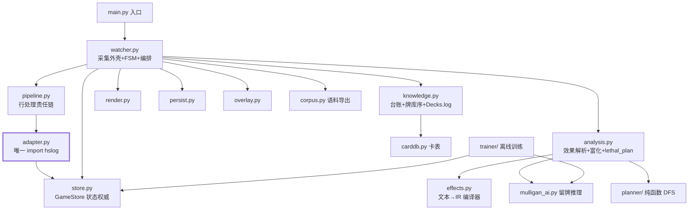

# hs_game_bot 项目蓝图 —— 结构 · 流程 · 规划

> 本文是全局视图：最终目录结构、运行入口、模块依赖、使用流程、里程碑排期。
> 细节文档：[DESIGN.md](DESIGN.md)（总设计）· [M1_MONITOR.md](M1_MONITOR.md)（M1 施工图）· [MULLIGAN_AI.md](MULLIGAN_AI.md)（留牌 AI）· [PLAY_ADVICE.md](PLAY_ADVICE.md)（推荐打法施工图，下阶段）· [MCTS_RESEARCH.md](MCTS_RESEARCH.md)（MCTS 效果解析完善程度调研）。

---

## 1. 目录结构（最终形态，标注引入里程碑）

```text
hs_game_bot/
├─ README.md / requirements.txt / config.yaml / 启动hsbot.bat
├─ docs/                            # 设计/施工图/审计报告(本目录全部入库)
├─ examples/                        # 解析教学样本；Power.log 留作回归素材
├─ scripts/                         # fetch_cards(卡表) / replay_capture(零变化验收)
├─ data/                            # 运行时数据（git 策略见 §6）
│  ├─ mulligan_prior.yaml           # 留牌专家先验——人工维护，入库
│  ├─ training/<卡组>/              # 训练语料(jsonl+原始切片)，入库(个人对局数据)
│  ├─ cache/ decks/ sessions/ models/   # 生成物，忽略
├─ hsbot/                           # 运行时包（python -m hsbot）
│  ├─ store.py                      # GameStore: 每局唯一状态权威(实体/事件衍生)
│  ├─ adapter.py                    # 唯一 import hslog / hearthstone.entities 的模块
│  ├─ pipeline.py                   # 行处理责任链(尾包判定/边界/切片/线索/喂解析)
│  ├─ watcher.py                    # 采集外壳 + FSM + 快照/导出/自动训练编排
│  ├─ analysis.py                   # 卡牌/效果解析层 + lethal_plan 编排($N/预估/富化)
│  ├─ effects.py                    # 卡牌文本 → 效果 IR 编译器 + 增量缓存
│  ├─ knowledge.py                  # 台账 + 牌库序 + Decks.log 解析
│  ├─ carddb.py / consts.py / config.py / persist.py
│  ├─ corpus.py                     # 训练语料导出(jsonl + 原始切片 + import-all)
│  ├─ mulligan_ai.py                # 留牌纯推理层(与 trainer 共用结论函数)
│  ├─ render.py / overlay.py / main.py
├─ planner/                         # T1 斩杀 DFS(纯函数; 只许 import hsbot.consts)
│  ├─ pieces.py / simstate.py / dfs.py / plan.py
└─ trainer/                         # 离线训练系统(单向依赖 trainer→hsbot)
   ├─ mulligan.py                   # 留牌模型(统计表/LR/TabPFN, 版本化模型库)
   ├─ material.py / states.py / value.py / backtest.py / __main__.py
```

> 2026-09-14 更新：原 M1 骨架(gamestate.py)已由分层化重构取代（store/analysis/render 三层 + 行处理责任链，见 AUDIT_2026-09-13/14）；planner/、trainer/ 为顶层独立包（与 hsbot 单向依赖，接合点=文件）。

演进原则：**每个里程碑只新增文件、不改既有文件的骨架**；`render.py` 是唯一允许跨里程碑持续扩展的模块（输出形态会一直加），`knowledge.py` 在 M2 拆出 `deck.py/carddb.py` 后退化为纯台账+牌库序。

---

## 2. 运行入口与使用流程

两个入口，共用同一套管线（回测只是换了数据源）：

```text
python -m hsbot                                          # 实时监控（M1 起, 配置见 config.yaml）
python -m hsbot replay examples/Power.log                           # 重放静态日志（M1 验收/开发用）
python -m hsbot.backtest --sessions data/sessions/...                 # 离线回测（M5）
```

`replay` 子命令的意义：不开游戏就能跑完整验收（M1_MONITOR §6 的六条全部可在样本日志上核对），也方便下断点调试。

日常使用流程：



---

## 3. 模块依赖图



两条铁律（违反即架构腐化）：

1. **`adapter.py` 是唯一 import hslog 的模块；`hearthstone.entities` 实体类也只许 adapter 碰**（图中加粗边）。第三方升级时只动它一个文件。`hearthstone.enums` 枚举视为全项目共享词表，允许各层 import（状态语义的通用语言，不属实体类）。
2. 依赖方向永远 `watcher → knowledge/planner`，规划器绝不反向调用渲染/持久化——它是纯函数（DESIGN §5"纯函数核心"）。

实时主循环细节见 [M1_MONITOR.md §4.2](M1_MONITOR.md)，此处不重复。

---

## 4. 里程碑规划

| 里程碑 | 目标 | 新增文件 | 验收 | 预估 |
|---|---|---|---|---|
| **M1 监控层** | 日志监控 + 状态维护 + 链路/快照输出 + jsonl | config / gamestate / adapter / watcher / knowledge / render / persist / main | M1_MONITOR §6 六条（可用 `replay` 子命令先过一遍，再上真实对局） | 1~2 人日 |
| **M2 知识层** | deck code→卡组、卡表+overlay、缺件概率曲线 | deck / carddb / planner/probability | "还差1张光子，2抽内到手37%" 这类输出；台账与牌局一致 | 1 人日 |
| **M3 启动 DFS** | 手牌全知的确定性最优线与总伤 | planner/simstate / dfs | 构造局面：给出的打牌顺序经人工验证为最优 | 1~2 人日 |
| **M4 MC+预备** | 中途抽牌 MC、下回合 P、法强曲线、可卖性 | planner/montecarlo / setup / plan | 全闭环：建议动态刷新，P 值随抽牌实时更新 | 2~3 人日 |
| **M5 回测** | 快照重放对账，校准假设表 | backtest/replay + 报告输出 | 期望伤害 vs 实际伤害误差报告；A1~A7 假设逐条有结论 | 1~2 人日 |

依赖关系严格线性：M1 → M2 → M3 → M4 → M5（M3 的 DFS 需要 M2 的卡表费用/伤害数据）。
每阶段交付即可运行、可验收的程序，不存在"全部做完才能跑"的集成风险。

### 下阶段定版（2026-09-13）

上表 M3（启动 DFS）/M4（MC+预备）并入"**推荐打法**"阶段，算法分层与任务拆解见
[PLAY_ADVICE.md](PLAY_ADVICE.md)：斩杀 DFS（T1）立即开工、不依赖数据量；
价值模型 × 浅层世界节点排序（T2）等 300+ 局语料放开口径；MCTS 暂缓（无模拟器 +
IR 覆盖率不足，达 T5 门槛才议）。M2 知识层的缺件概率曲线随 T3 一并交付。

---

## 5. 与现有 examples/ 的关系

- `examples/hslog_utils.py` 的 `iter_game_chunks / parse_lines / build_game` 三个函数是 `adapter.py / watcher.py` 的直接起点（M1 搬进包内，带 `tolerate_missing_entities=True`）。
- `examples/full_game_info.py / realtime_demo.py` 保留作教学参考，不再演进。
- `examples/Power.log` 定位转为**回归测试素材**：M1 的 `replay` 子命令验收、M5 的算法回归都用它，升级 hslog 版本后重跑一遍即可发现解析兼容性问题。

## 6. Git 与数据文件策略

| 类别 | 处理 |
|---|---|
| 入库 | `docs/`、`hsbot/`、`planner/`、`trainer/`、`examples/`、`scripts/`、`data/mulligan_prior.yaml`（人工维护的专家先验，是"代码"不是数据）、`data/training/`（个人对局语料：jsonl + 原始切片，用户要求入库，2026-09-13 起） |
| 忽略 | `data/sessions/`、`data/cache/`、`data/decks/`、`data/models/`、`trainer/data/`（全部为生成物） |
| 提交节奏 | 每个里程碑一个分支，验收标准全过才合入 main；提交信息建议 `M1: 监控层——链路输出+回合快照` 样式 |
